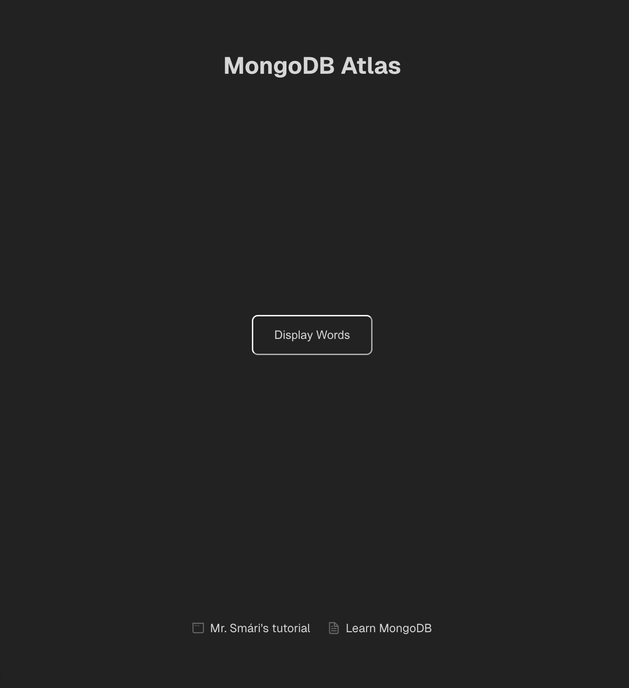

### School project
This project's sole purpose is to connect to a database and display the contents. In the first round it's just a bare-minimum-type-of-a-deal.
I followed my [sensei's tutorial](https://blog.stackademic.com/the-mongodb-and-next-js-stack-for-beginners-b4394872f5bb) (Hæ Smári!) 

It's very basic, only a button on landing page. Click button and get four randomized words from the database. 




I deviated a little bit from the tutorial and added to it some things that were needed for what I wanted to display. I've f.ex. added hooks to manage component state and I'm using effect hooks for fetching data from my API. Also incorporated f.ex. arrays, props, event handling, async functions and more. 

I´ve included the client and server side logs that were a part of the tutorial. 

On the landing page I've included a link to Smári's tutorial and a link wher you can learn MongoDB

-----

### In other news
This is a [Next.js](https://nextjs.org) project bootstrapped with [`create-next-app`](https://nextjs.org/docs/app/api-reference/cli/create-next-app).

## Getting Started

First, run the development server:

```bash
npm run dev
# or
yarn dev
# or
pnpm dev
# or
bun dev
```

Open [http://localhost:3000](http://localhost:3000) with your browser to see the result.

You can start editing the page by modifying `app/page.tsx`. The page auto-updates as you edit the file.

This project uses [`next/font`](https://nextjs.org/docs/app/building-your-application/optimizing/fonts) to automatically optimize and load [Geist](https://vercel.com/font), a new font family for Vercel.

## Learn More

To learn more about Next.js, take a look at the following resources:

- [Next.js Documentation](https://nextjs.org/docs) - learn about Next.js features and API.
- [Learn Next.js](https://nextjs.org/learn) - an interactive Next.js tutorial.

You can check out [the Next.js GitHub repository](https://github.com/vercel/next.js) - your feedback and contributions are welcome!

## Deploy on Vercel

The easiest way to deploy your Next.js app is to use the [Vercel Platform](https://vercel.com/new?utm_medium=default-template&filter=next.js&utm_source=create-next-app&utm_campaign=create-next-app-readme) from the creators of Next.js.

Check out our [Next.js deployment documentation](https://nextjs.org/docs/app/building-your-application/deploying) for more details.
